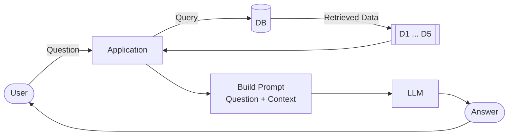
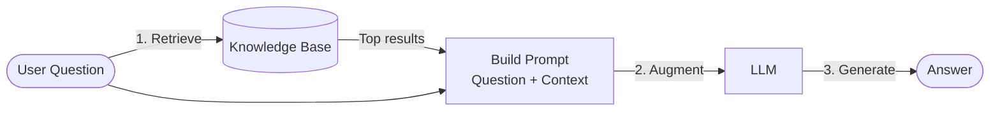

## Part 1: RAG

### 1.1 Introductions

#### What are LLMs

An LLM (Large Language Model) is a neural network trained on vast amounts of text data. Its core task is next-token prediction: given some input text, it predicts the most likely continuation.

A simple analogy: a search engine's autocomplete suggests the next word based on what millions of users typed before. An LLM does the same but at a much larger scale with billions of parameters trained on most of the internet, making it seem like you are talking to something that truly understands you.

In this course, LLMs are treated as black boxes: text in, text out. We call them via API and don't look inside.

**Limitations:**

- **Knowledge cutoff:** only knows what was in its training data, ignorant of anything more recent
- **No access to private data:** cannot see your documents or databases unless you explicitly provide them
- **Hallucinations:** can confidently produce wrong answers

#### The Project

RAG (Retrieval-Augmented Generation) addresses the limitations above by fetching relevant documents at query time and handing them to the LLM as context. Instead of hoping the model memorized the answer, we retrieve the right information and let it generate a grounded response.

The concrete project in this module is a FAQ agent for the course itself. A student asks something like "when does the course start?" and the agent answers from prepared FAQ data.

The module is split into two parts:

- **Part 1:** build a RAG pipeline with keyword search from scratch
- **Part 2:** make it agentic so the LLM decides when and what to search, instead of running the same fixed flow every time

### 1.2 Environment Setup

Install `uv` (fast Python package manager):

```bash
curl -LsSf https://astral.sh/uv/install.sh | sh
```

Create project and add dependencies:

```bash
uv init
uv add requests minsearch openai jupyter python-dotenv
```

Store the API key in `.env` (never commit this file):

```
OPENAI_API_KEY=sk-YOUR_KEY_HERE
```

Add `.env` to `.gitignore`. Start Jupyter with:

```bash
uv run jupyter notebook
```

Verify the setup:

```python
from dotenv import load_dotenv
load_dotenv()

from openai import OpenAI
openai_client = OpenAI()
```

For alternative providers (e.g. Groq), set the key and override `base_url`:

```python
openai_client = OpenAI(
    api_key=os.getenv("GROQ_API_KEY"),
    base_url="https://api.groq.com/openai/v1"
)
```

### 1.3 What is RAG

A plain LLM only knows what was in its training data. Ask it something specific to your own data (e.g. course enrollment policies) and it either guesses or refuses. The fix: give it the relevant information as part of the prompt.



**RAG (Retrieval-Augmented Generation)** automates exactly that:

1. Take the user's question
2. Search a knowledge base for relevant documents
3. Inject those documents into the prompt as context
4. Let the LLM generate a grounded answer

In code, the full pipeline collapses to three steps:

```python
def rag(question):
    search_results = search(question)
    user_prompt = build_prompt(question, search_results)
    return llm(user_prompt)
```

The three components are independent and swappable: any search engine, any prompt template, any LLM. Answer quality is directly tied to retrieval quality: if the wrong documents are retrieved, the LLM gets the wrong context and the answer will be wrong.

### 1.4 The Course FAQ Dataset

The FAQ originated from students repeatedly asking the same questions in Slack. Those were collected into a single document so people can search before asking. Older courses like Data Engineering Zoomcamp have run for five cohorts and accumulated hundreds of entries, making manual search tedious. That is exactly the problem the RAG system solves.

The data is available as JSON from the DataTalks.Club website:

```python
import requests

docs_url = "https://datatalks.club/faq/json/courses.json"
response = requests.get(docs_url)
courses_raw = response.json()

documents = []
url_prefix = "https://datatalks.club/faq"

for course in courses_raw:
    course_url = f"""{url_prefix}{course["path"]}"""
    course_response = requests.get(course_url)
    course_response.raise_for_status()
    documents.extend(course_response.json())
```

`raise_for_status()` raises an error immediately if a request fails instead of silently continuing.

Each document has these fields:

| Field      | Description                                    |
| ---------- | ---------------------------------------------- |
| `id`       | Unique identifier                              |
| `course`   | Course slug (e.g. `machine-learning-zoomcamp`) |
| `section`  | Section of the course                          |
| `question` | The FAQ question                               |
| `answer`   | The FAQ answer                                 |

The `course` field enables filtering by course, `section` adds useful ranking context. In the RAG pipeline: index all documents, search on the user's question, pass the top results as context to the LLM.

> **Data preparation note:** This dataset is already clean because the instructor maintains the website. In real projects, expect to spend a lot of time scraping, parsing PDFs, and chunking documents before getting to the GenAI part. The course skips this step on purpose to stay focused on the RAG pipeline itself.

### 1.5 Search

#### How Search Works

Every search engine does the same thing: score every document against the query and return the top N results.

```python
score = sim(query, document)
```

What differs between engines is what `sim` computes:

- **Text/lexical search:** counts shared words (exact surface match)
- **Vector/semantic search:** compares meaning (covered in Module 2)

Limitation of text search: "Can I still join?" and "Is it possible to enroll late?" mean the same thing but share almost no keywords, so a text search engine would struggle to connect them.

#### Why Not Send All Documents to the LLM?

With ~1100 documents, sending everything to the LLM would be expensive, slow, and confusing for the model. Search finds the most relevant candidates first.

#### minsearch

[minsearch](https://github.com/alexeygrigorev/minsearch) is a lightweight in-memory search engine built for teaching. It uses the same concepts as Elasticsearch (text fields, keyword fields, boosting, filtering) but runs anywhere Python runs, without Docker. Useful for small datasets.

**Text fields** are tokenized and ranked by relevance. **Keyword fields** require an exact match, like a SQL `WHERE` clause, and restrict the search space to a subset (e.g. only results from one course).

```python
from minsearch import Index

index = Index(
    text_fields=["question", "section", "answer"],
    keyword_fields=["course"]
)

index.fit(documents)
```

`fit` comes from scikit-learn terminology: fitting the index on the documents.

#### Searching and Boosting

```python
search_results = index.search(
    question,
    boost_dict={"question": 2.0, "section": 0.5},
    filter_dict={"course": "llm-zoomcamp"},
    num_results=5
)
```

- `boost_dict`: relative field importance. Default is 1.0. A match in `question` (boost 2.0) counts twice as much as in `answer`. A match in `section` (boost 0.5) counts half as much.
- `filter_dict`: hard filter on keyword fields. Only results from the specified course are returned.

#### Wrapping it as a Function

```python
def search(question, course="llm-zoomcamp"):
    boost_dict = {"question": 2.0, "section": 0.5}
    filter_dict = {"course": course}

    return index.search(
        question,
        boost_dict=boost_dict,
        filter_dict=filter_dict,
        num_results=5
    )
```

This is the first component of the RAG pipeline.

### 1.6 Building a Prompt

The prompt is split into two parts:

- **Instructions (system prompt):** fixed for every request, tells the LLM how to behave
- **User prompt:** changes with every request, carries the question and retrieved context

Keeping them separate makes the fixed part easy to reuse and the changing part easy to rebuild each time.

```python
INSTRUCTIONS = """
Your task is to answer questions from the course participants
based on the provided context.

Use the context to find relevant information and provide accurate
answers. If the answer is not found in the context,
respond with "I don't know."
"""

USER_PROMPT_TEMPLATE = """
Question:
{question}

Context:
{context}
"""
```

The `context` is built by converting the list of search result dicts into a readable string:

```python
def build_context(search_results):
    lines = []
    for doc in search_results:
        lines.append(doc["section"])
        lines.append("Q: " + doc["question"])
        lines.append("A: " + doc["answer"])
        lines.append("")
    return "\n".join(lines).strip()
```

The full `build_prompt` function combines both:

```python
def build_prompt(question, search_results):
    context = build_context(search_results)
    prompt = USER_PROMPT_TEMPLATE.format(
        question=question,
        context=context
    )
    return prompt.strip()
```

`.strip()` removes leading/trailing whitespace from the template literals.

The prompt is the bridge between search and the LLM. A bad prompt lets the LLM ignore the context and hallucinate. Prompt engineering is iterative: later in the course, evaluation metrics replace guesswork.

### 1.7 RAG Pipeline

The last missing piece is the LLM. Combined with search and build prompt, it completes the full RAG pipeline.

#### Responses API vs. Chat Completions

OpenAI exposes two APIs:

| API                | Status              | When to use                 |
| ------------------ | ------------------- | --------------------------- |
| `chat.completions` | Legacy              | Other providers, older code |
| `responses`        | Current (preferred) | This course                 |

```python
response = openai_client.responses.create(
    model="gpt-5.4-mini",
    input=prompt
)
```

**Note on other providers:** Groq, Gemini, and most third-party providers expose the Chat Completions interface, not Responses. If you switch providers, keep the OpenAI client but call `openai_client.chat.completions.create(...)` instead.

#### The Response Object

The answer is buried a few levels deep:

```python
response.output[0].content[0].text  # long path
response.output_text                 # shortcut - same result
```

#### Token Usage and Cost

```python
response.usage
# ResponseUsage(input_tokens=334, output_tokens=39, total_tokens=373)
```

Computing the cost for `gpt-5.4-mini`:

```python
input_price  = 0.75 / 1_000_000   # $ per token
output_price = 4.50 / 1_000_000

cost = (
    response.usage.input_tokens  * input_price +
    response.usage.output_tokens * output_price
)
```

A typical RAG query costs a fraction of a cent. Cached input tokens (repeated prompt prefixes) are billed at a lower rate.

#### Message History

Instead of sending a single string, the API expects a list of messages with roles, the same structure ChatGPT uses internally to maintain conversation context:

```python
message_history = [
    {"role": "developer", "content": INSTRUCTIONS},  # fixed system part
    {"role": "user",      "content": prompt}          # changes per request
]

response = openai_client.responses.create(
    model="gpt-5.4-mini",
    input=message_history
)
```

Both `developer` and `system` are accepted for the instruction role; in practice there is no observable difference. This course uses `developer`.

#### The `llm` Function

```python
def llm(instructions, user_prompt, model="gpt-5.4-mini"):
    message_history = [
        {"role": "developer", "content": instructions},
        {"role": "user",      "content": user_prompt}
    ]
    response = openai_client.responses.create(
        model=model,
        input=message_history
    )
    return response.output_text
```

#### Putting it All Together

```python
def rag(query, model="gpt-5.4-mini"):
    search_results = search(query)
    prompt         = build_prompt(query, search_results)
    answer         = llm(INSTRUCTIONS, prompt, model=model)
    return answer
```

```
User question
    → search()       → top-5 documents from minsearch
    → build_prompt() → prompt with injected context
    → llm()          → grounded answer
```

The three components are independent and swappable. Replacing `minsearch` with `sqlitesearch` later only requires changing `search()` - nothing else in the pipeline needs to change.

### 1.8 RAG Helper

The pipeline works, but the code is scattered across a notebook. Since we will reuse it throughout the course, we extract it into two reusable Python files.

- `ingest.py` - loading data and building the search index
- `rag_helper.py` - the RAG logic wrapped in a class

#### ingest.py

Two functions that handle everything needed before searching:

```python
import requests
from minsearch import Index

def load_faq_data():
    docs_url = "https://datatalks.club/faq/json/courses.json"
    response = requests.get(docs_url)
    courses_raw = response.json()

    documents = []
    url_prefix = "https://datatalks.club/faq"

    for course in courses_raw:
        course_url = f"""{url_prefix}{course["path"]}"""
        course_response = requests.get(course_url)
        course_response.raise_for_status()
        documents.extend(course_response.json())

    return documents

def build_index(documents):
    index = Index(
        text_fields=["question", "section", "answer"],
        keyword_fields=["course"]
    )
    index.fit(documents)
    return index
```

#### rag_helper.py - Why a Class?

`index` and `openai_client` were global variables in the notebook. Moving the functions to a separate file breaks that. We could import those globals back, but that ties the file to one specific index and one specific client, making it hard to swap components later.

The solution is **encapsulation**: put the dependencies into a class constructor. Now any index or client can be injected from outside. Subclassing later lets us override one component (e.g. swap OpenAI for a local model) without touching the rest.

```python
INSTRUCTIONS = """
Your task is to answer questions from the course participants
based on the provided context.

Use the context to find relevant information and provide accurate
answers. If the answer is not found in the context,
respond with "I don't know."
"""

PROMPT_TEMPLATE = """
QUESTION: {question}

CONTEXT:
{context}
""".strip()
```

#### RAGBase

```python
class RAGBase:

    def __init__(
        self,
        index,
        llm_client,
        instructions=INSTRUCTIONS,
        prompt_template=PROMPT_TEMPLATE,
        course="llm-zoomcamp",
        model="gpt-5.4-mini"
    ):
        self.index = index
        self.llm_client = llm_client
        self.instructions = instructions
        self.course = course
        self.prompt_template = prompt_template
        self.model = model

    def search(self, query, num_results=5):
        boost_dict = {"question": 3.0, "section": 0.5}
        filter_dict = {"course": self.course}
        return self.index.search(
            query,
            num_results=num_results,
            boost_dict=boost_dict,
            filter_dict=filter_dict
        )

    def build_context(self, search_results):
        lines = []
        for doc in search_results:
            lines.append(doc["section"])
            lines.append("Q: " + doc["question"])
            lines.append("A: " + doc["answer"])
            lines.append("")
        return "\n".join(lines).strip()

    def build_prompt(self, query, search_results):
        context = self.build_context(search_results)
        return self.prompt_template.format(question=query, context=context)

    def llm(self, prompt):
        input_messages = [
            {"role": "developer", "content": self.instructions},
            {"role": "user", "content": prompt}
        ]
        response = self.llm_client.responses.create(
            model=self.model,
            input=input_messages
        )
        return response.output_text

    def rag(self, query):
        search_results = self.search(query)
        prompt = self.build_prompt(query, search_results)
        return self.llm(prompt)
```

Only `index` and `llm_client` are required. All other parameters have sensible defaults and only need to be passed when overriding.

#### Using it in a Notebook

```python
from dotenv import load_dotenv
load_dotenv()

from ingest import load_faq_data, build_index
from rag_helper import RAGBase
from openai import OpenAI

documents = load_faq_data()
index = build_index(documents)
openai_client = OpenAI()

assistant = RAGBase(index=index, llm_client=openai_client)

answer = assistant.rag("I just discovered the course. Can I join now?")
print(answer)
```

To override instructions:

```python
custom_instructions = """
You're a course teaching assistant.
Answer the QUESTION based on the CONTEXT from the FAQ database.
Use only the facts from the CONTEXT when answering the QUESTION.
""".strip()

assistant = RAGBase(
    index=index,
    llm_client=openai_client,
    instructions=custom_instructions,
)
```

Swapping the search backend later only requires passing a different `index` object. Swapping the LLM only requires subclassing `RAGBase` and overriding `llm()`.

### 1.9 Data Ingestion

So far the RAG pipeline loads and indexes data at startup every time the process starts. With minsearch this is fine because the FAQ dataset is tiny. It breaks down as the dataset grows: indexing takes longer, and minsearch is in-memory so the data is gone the moment the process stops.

The fix is to separate ingestion from querying. One process writes data to a persistent index once. Another process reads from it. They share nothing except the index file on disk.

#### Why sqlitesearch

SQLite ships with Python and has FTS5 (full-text search) built in. `sqlitesearch` is a thin wrapper around SQLite FTS5 that exposes the same API as minsearch, making it a drop-in replacement.

```bash
uv add sqlitesearch
```

No extra services needed. If you have Python, you have everything required.

#### Ingestion Process

A separate notebook (or script) fetches the data and writes it to a `.db` file:

```python
import time
from ingest import load_faq_data
from sqlitesearch import TextSearchIndex

documents = load_faq_data()
docs_llm = [doc for doc in documents if doc["course"] == "llm-zoomcamp"]

index = TextSearchIndex(
    text_fields=["question", "section", "answer"],
    keyword_fields=["course"],
    db_path="faq.db"
)

for doc in docs_llm:
    index.add(doc)

index.close()
```

`faq.db` persists on disk. Run this once; the query process never needs to re-ingest.

Add `faq.db` to `.gitignore` - it's a binary file that should not be committed.

#### Query Process

The RAG assistant just connects to the existing database file:

```python
from sqlitesearch import TextSearchIndex
from rag_helper import RAGBase
from openai import OpenAI

sqlite_index = TextSearchIndex(
    text_fields=["question", "section", "answer"],
    keyword_fields=["course"],
    db_path="faq.db"
)

assistant = RAGBase(
    index=sqlite_index,
    llm_client=OpenAI(),
)

answer = assistant.rag("Can I still join the course after it started?")
print(answer)
```

No `fit()`, no data loading, no waiting. The index is already there. Because `sqlitesearch` has the same `search()` interface as `minsearch`, `RAGBase` works unchanged.

#### The Architecture

```
minsearch (single process):
  startup: fetch -> parse -> index -> ready
  every restart: repeat all steps

sqlitesearch (two processes):
  ingestion (once): fetch -> parse -> write to faq.db
  query (every time): open faq.db -> search -> ready
```

The two processes are fully independent. One can be ingesting new documents while the other is answering queries - normal database behavior that is impossible with an in-memory index.

#### When to Use Which

|                  | minsearch                       | sqlitesearch                           |
| ---------------- | ------------------------------- | -------------------------------------- |
| Storage          | In-memory                       | File (SQLite)                          |
| Survives restart | No                              | Yes                                    |
| Setup            | None                            | Run ingestion once                     |
| Use when         | Data is small, indexing is fast | Ingestion is slow or data must persist |

For production systems the same pattern applies with a different backend (Elasticsearch, Qdrant, Weaviate). The architecture stays the same: one process ingests, another queries.

### 1.10 Wrap-up of Part 1

#### RAG in 3 Steps



1. **Retrieve** - send the user's question to the knowledge base, get the top N relevant documents
2. **Augment** - inject those documents into the prompt as context alongside the question
3. **Generate** - the LLM reads the prompt and produces a grounded answer

#### Ingestion vs. Querying

The knowledge base does not fill itself. A separate ingestion process fetches, parses, and indexes the data. In Part 1 we ran both in the same notebook (fine for small datasets). In production they are split:

```
Ingestion process  ->  [Knowledge Base on disk]  <-  RAG assistant
```

The two processes are independent and connected only through the database. This is why sqlitesearch (or Elasticsearch, Qdrant, etc.) matters: it makes the index survive between restarts.

#### What's Next

**Part 2 (Agents):** The current pipeline is fixed - it always runs one search with the exact user query. An agent puts the LLM in control: it decides what to search for, how many times, and when enough context has been gathered.

**Module 2 (Vector Search):** Keyword search matches exact words. Vector search matches by meaning, which handles cases where the user phrases things differently from the FAQ.

#### Fine-tuning vs RAG

Fine-tuning adjusts the model's weights for your data. It sounds appealing but has real drawbacks:

- Requires GPUs and specialized tooling
- Hard to update when new data arrives (re-train for every new FAQ entry?)
- The model already has broad knowledge; RAG just gives it access to what it was not trained on

RAG is more flexible, cheaper, and works with any LLM off the shelf. Reach for fine-tuning only when RAG genuinely cannot solve the problem.

## Part 2: Agents

## Homework

## Optional
