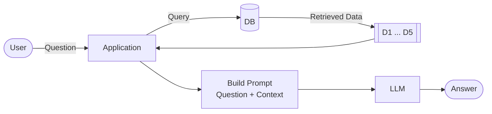
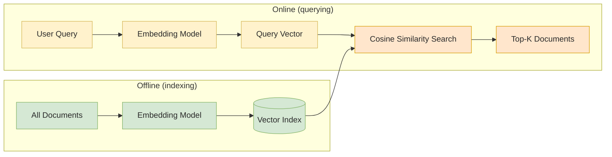
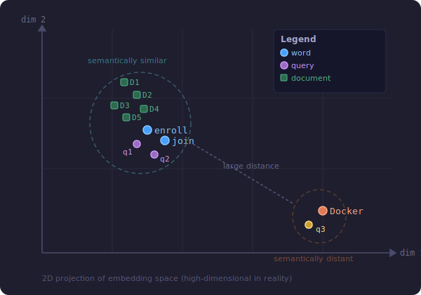
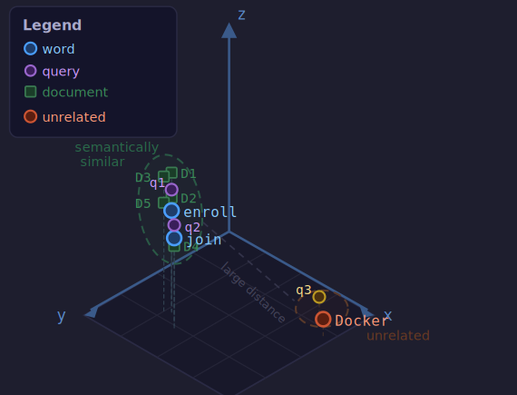
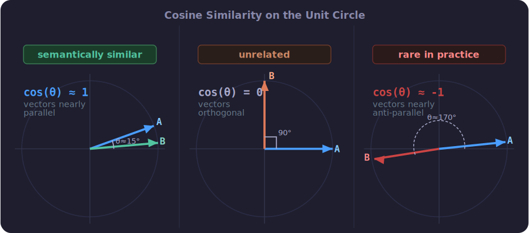

# Module 2: Vector Search

## Part 1: Vector Search

### 2.1 What is Vector Search

In Module 1 we built a RAG pipeline with keyword search. Here is the full picture again:



The search step in the middle is what this module is about. Module 1 used keyword search there. This module replaces it with vector search.

#### Keyword search and its problem

Keyword search decomposes the query into individual words and looks for documents that contain them. Ranking algorithms like BM25 or TF-IDF score documents by how many of those words appear and how often.

This works well for exact matches. It breaks down when the user phrases the question differently from how the document is written.

Example:

| Query                                                | Words                  |
| ---------------------------------------------------- | ---------------------- |
| "I just discovered the course, can I still join?"    | discover, course, join |
| "I found out about the program, can I still enroll?" | find, program, enroll  |

Both questions mean exactly the same thing. But they share almost no words. A keyword engine searching for the first query will not find documents written with the vocabulary of the second, and vice versa.

Vector search solves this.

#### What vector search does

Instead of matching words, vector search matches meaning. It converts text into a vector, a fixed-length array of numbers that captures the semantic content of the text. Texts with similar meaning produce similar vectors, regardless of which exact words were used.

The model that produces these vectors is called an **embedding model**. It is a neural network trained specifically to map meaning into a numeric space.

#### Two stages

Vector search runs in two stages:



**Offline (indexing):** embed every document once and store the vectors in an index. This is done ahead of time.

**Online (querying):** embed the incoming query with the same model, then find the stored vectors closest to it by cosine similarity.

#### Cosine similarity

Cosine similarity measures the angle between two vectors in the embedding space:

- Vectors pointing in the same direction: similarity close to 1 -> similar meaning
- Vectors at right angles: similarity close to 0 -> unrelated
- Vectors pointing in opposite directions: similarity close to -1 -> opposite meaning

The higher the cosine similarity, the more semantically similar the two texts are.

#### Keyword search vs vector search

|               | Keyword search                | Vector search                           |
| ------------- | ----------------------------- | --------------------------------------- |
| Matches       | Exact words                   | Meaning                                 |
| Strengths     | Specific terms, IDs, names    | Paraphrased questions, natural language |
| Example query | "pandas dataframe"            | "How do I work with tabular data?"      |
| Index type    | Inverted index (BM25, TF-IDF) | Vector index (cosine similarity)        |
| Misses        | Synonyms and paraphrases      | Exact term matches                      |

#### When to use vector search

Vector search is usually better at capturing intent, but it adds significant operational complexity: you need an embedding model, a vector index, and more infrastructure. You will feel this throughout the module.

**Advice: do not start with vector search.** Start with keyword search. Reach for vectors only when you can show they are worth the extra cost.

In practice the two work best together. Hybrid search combines keyword and vector search and is covered in Module 6 (Best Practices).

#### What this module covers

We build vector search with three tools, in increasing operational weight:

1. **minsearch** - in-memory vector search. Simplest, good for experiments.
2. **sqlitesearch** - persistent vector search backed by SQLite. Production-friendly, same API as minsearch.
3. **PGVector** - vector search in PostgreSQL. Scalable, runs in Docker.

Then we plug vector search into the RAG pipeline from Module 1.

---

### 2.2 Embeddings

Before we can do vector search, we need to turn text into vectors. This process is called **embedding**: we embed text into a vector space. The resulting arrays of numbers are also called "embeddings."

#### The vector space idea

The idea comes from word2vec. A model learns to place words as points in a multi-dimensional space. Words with similar meanings land close to each other. Dissimilar words land far apart.

<table>
<tr>
<td align="center"><br/><sub>2D projection</sub></td>
<td align="center"><br/><sub>3D isometric view</sub></td>
</tr>
</table>

In the diagram above, "enroll" and "join" are near each other because they mean similar things. "Docker" is far away because it is semantically unrelated. The same applies to full sentences: q1 ("I just discovered the course, can I still join?") and q2 ("I found out about the program, can I still enroll?") land close together. q3 ("How do I run Docker on Windows?") lands far away.

Documents D1-D5 from the knowledge base sit in the same space. When a user sends a query, we embed it and return the nearest documents. Those are our search results.

#### From words to sentences

An embedding model encodes the whole sentence, not individual words in isolation. This matters because the same word can mean different things in different contexts.

Example: the word "judge"

- "The judge ruled out the possibility of crime" -> legal meaning
- "LLM-as-a-judge approach to evaluate LLMs" -> ML evaluation meaning

The surrounding context shifts the embedding. The model captures this.

#### Installing sentence-transformers

We use [sentence-transformers](https://www.sbert.net/), an open-source library that runs locally with no API costs.

```bash
uv add sentence-transformers
```

This pulls in PyTorch, so the first install downloads a lot. That is expected.

#### Choosing a model

We use `all-MiniLM-L6-v2`:

- 384-dimensional vectors (compact)
- Fast on CPU
- Good quality for general English text
- Outputs normalized vectors -> dot product equals cosine similarity

```python
from sentence_transformers import SentenceTransformer

model = SentenceTransformer("all-MiniLM-L6-v2")
```

The first run downloads the model (~80 MB) and its tokenizer from HuggingFace. After that, both load from local cache.

#### Trying it: encoding and comparing

Encode a query:

```python
q1 = "Can I still join the course after the start date?"
v1 = model.encode(q1)
# v1.shape -> (384,)
```

`v1` is an array of 384 numbers. Each number represents some concept the model learned internally. We cannot read off what any single dimension means, but two vectors with similar values point to texts about similar things.

Encode a document and compare with dot product:

```python
d  = "You don't need to register. You can just start learning and submitting homework."
dv = model.encode(d)

v1.dot(dv)   # -> 0.32  (related)
```

Now compare with an unrelated query:

```python
q2 = "How to install Docker on Windows?"
v2 = model.encode(q2)

v2.dot(dv)   # -> 0.01  (unrelated)
```

The first score (`0.32`) is higher because q1 and `d` are both about course enrollment. The second score (`0.01`) is near zero because Docker has nothing to do with registration. Near zero means the two vectors are nearly orthogonal: no shared meaning.

#### Cosine similarity and the dot product

`all-MiniLM-L6-v2` outputs **normalized** vectors (unit length). For unit vectors, dot product equals cosine similarity:

$$
\cos(\theta) = \frac{\mathbf{v}_1^T\mathbf{v}_2}{\underbrace{\|\mathbf{v}_1\|\|\mathbf{v}_2\|}_{=1}} = \mathbf{v}_1^T\mathbf{v}_2, \quad \mathbf{v}_1, \mathbf{v}_2 \in \mathbb{R}^n \\
$$



 
Cosine similarity values:

| Value | Angle   | Meaning                       |
| ----- | ------- | ----------------------------- |
| 1.0   | 0 deg   | same direction, similar texts |
| 0.0   | 90 deg  | perpendicular, unrelated      |
| -1.0  | 180 deg | opposite direction            |

In practice we rarely see values below 0. The embedding model maps all text into a region where vectors mostly have positive components. There is no concept of "opposite meaning" that produces a truly opposite vector.

That is the whole mechanism behind vector search: similar texts -> similar vectors -> high dot product score -> returned as top results.

---

### 2.3 Embedding Our Dataset

Now that we know how to embed individual texts, we embed the full FAQ dataset so it can be searched.

#### The dataset

The FAQ data comes from DataTalksClub courses. We load it with a helper:

```python
from ingest import load_faq_data

documents = load_faq_data()
```

`load_faq_data()` fetches the course list from the DataTalksClub website and downloads the Q&A entries for each course. Each document is a dictionary:

```python
documents[10]
# {
#   'course':   'data-engineering-zoomcamp',
#   'section':  'General Course-Related Questions',
#   'question': 'Course: How many hours per week am I expected to spend?',
#   'answer':   'It depends on your background ...',
#   'doc_id':   '316180784f'
# }
```

Total: **1350 documents** across all courses.

#### Preparing texts for embedding

An embedding model takes a single string, not a dictionary. We concatenate `question` and `answer` for each document:

```python
texts = [doc["question"] + doc["answer"] for doc in documents]
```

This gives the model both the topic (question) and the content (answer) in one shot, which tends to produce better search results than embedding either field alone.

#### Batch embedding

Passing all 1350 texts to the model at once is wasteful: no progress feedback and a large memory spike. We split into batches of 50:

```python
from tqdm.auto import tqdm

def embed_documents(texts, chunk_size=50):
    vectors = []
    for i in tqdm(range(0, len(texts), chunk_size)):
        batch = texts[i : i + chunk_size]
        vectors.extend(model.encode(batch))
    return vectors

vectors = embed_documents(texts, chunk_size=50)
```

`tqdm` wraps the loop so we see a progress bar, useful because encoding on CPU takes a few minutes for this many documents.

The result is a list of 1350 vectors, each of shape `(384,)`:

```python
len(vectors)   # 1350
vectors[0].shape  # (384,)
```

Each vector is the embedded representation of one document. In the next section we use these vectors to build a searchable index.

---

### 2.4 Vector Search

With 1350 document vectors and a query vector in hand, we need to find the most similar documents. This section builds that search step by step.

#### The naive approach

The straightforward way: loop over every document vector and compute the dot product with the query.

```python
scores_naive = [v1 @ v for v in vectors]
best_match_idx = np.argmax(scores_naive)
# Best match index: 2, similarity: 0.7629
```

This works, but it is a Python loop and slow for large datasets.

#### Matrix-vector multiplication

A much faster approach: stack all document vectors into a single NumPy matrix and do one matrix-vector multiply.

```python
X = np.array(vectors)   # shape: (1350, 384)
scores = X @ v1         # shape: (1350,)
```

`X @ v1` computes the dot product of `v1` against every row of `X` in a single call. NumPy dispatches this to an optimized BLAS routine (C/Fortran), so it is orders of magnitude faster than the Python loop while producing identical results.

#### Finding the best match

`np.argmax` returns the index of the highest score:

```python
idx = np.argmax(scores)
# idx=2, score=0.7629
documents[idx]
# {'course': 'data-engineering-zoomcamp',
#  'question': 'Course: Can I still join the course after the start date?',
#  'answer': "Yes, even if you don't register, you're still eligible ...",
#  'doc_id': '3f1424af17'}
```

The query was "Can I still join the course after the start date?". The top hit is an exact semantic match.

#### Retrieving the top-5

`np.argsort` returns indices that would sort the array in ascending order. To get the top 5, take the last 5 and reverse them:

```python
top_5_idx = np.argsort(scores)[-5:][::-1]
```

A shorter equivalent: negate the scores first, then argsort ascending and take the first 5:

```python
top_5_idx = np.argsort(-scores)[:5]
```

Results for the same query:

| Rank | Score | Course                    | Question (abbreviated)                            |
| ---- | ----- | ------------------------- | ------------------------------------------------- |
| 1    | 0.763 | data-engineering-zoomcamp | Can I still join the course after the start date? |
| 2    | 0.758 | mlops-zoomcamp            | Can I still join the course after the start date? |
| 3    | 0.719 | machine-learning-zoomcamp | The course has already started. Can I still join? |
| 4    | 0.654 | llm-zoomcamp              | I just discovered the course. Can I still join?   |
| 5    | 0.560 | data-engineering-zoomcamp | Can I follow the course after it finishes?        |

All five results are semantically about joining a course late. Ranks 1–4 are the same question rephrased across different courses. This is exactly the cross-course synonym problem that keyword search cannot handle.

Later sections add course filtering so we can restrict results to a single course before returning them.

---

### 2.5 Vector Search with `minsearch`

The NumPy approach from 2.4 works, but it is low-level: we manage the matrix manually, call `argsort`, and have no built-in way to filter by course. `minsearch` wraps all of that behind a clean API.

`minsearch` is the same library used in Module 1 for keyword search. It also ships a `VectorSearch` class that does the same brute-force cosine search we built manually, plus keyword field filtering on top.

#### Building the index

```python
from minsearch import VectorSearch

vindex = VectorSearch(keyword_fields=["course"])
vindex.fit(X, documents)
```

- `keyword_fields=["course"]` tells the index which fields can be used as exact-match filters at query time.
- `.fit(X, documents)` stores the embedding matrix `X` (shape `(1350, 384)`) alongside the original document dictionaries.

#### Searching with a filter

```python
results = vindex.search(
    v1,
    num_results=5,
    filter_dict={"course": "llm-zoomcamp"},
)
```

- `v1` is the query vector (shape `(384,)`).
- `filter_dict` pre-filters the index to only consider documents where `course == "llm-zoomcamp"` before scoring.
- `num_results=5` returns the top 5 from that filtered set.

With the filter applied, all results now belong to the LLM Zoomcamp course:

```python
# results[0]
{
  'course':   'llm-zoomcamp',
  'section':  'General Course-Related Questions',
  'question': 'I just discovered the course. Can I still join?',
  'answer':   'Yes, but if you want to receive a certificate ...',
  'doc_id':   '74eb249bbf'
}
```

Compare with the unfiltered results from 2.4: the llm-zoomcamp entry was ranked 4th there. With filtering, it rises to 1st because irrelevant courses are excluded first.

#### Why filtering matters

Without filtering, the top results are almost always the same question from different courses. A student using an LLM Zoomcamp assistant does not care about those answers. `filter_dict` fixes this with one line instead of post-processing the ranked list.

Under the hood, `VectorSearch` still does the same matrix-vector multiplication; the filter just masks rows before the dot product is computed.

---

### 2.6 RAG with Vector Search

The full RAG pipeline from Module 1 has three steps:

```
search(query) → build_prompt(query, results) → llm(prompt) → answer
```

Only the first step changes when switching to vector search. `build_prompt` and `llm` are identical. This is the payoff of keeping the pipeline modular.

#### `RAGBase` recap

`RAGBase` (in `rag_helper.py`) wires up the three steps. Its `search()` uses the minsearch keyword index with a boost dict and a `filter_dict` that restricts results to `self.course` (default: `'llm-zoomcamp'`):

```python
assistant = RAGBase(index=index, llm_client=openai_client)
assistant.rag("I just found out about the program, can I still enroll?")
# -> 'Yes, you can still enroll. If you want to receive a certificate,
#     make sure to submit your project while submissions are still open.'
```

#### Swapping in vector search

We create a subclass that overrides only `search()`. The override embeds the query string into a vector, then delegates to the `VectorSearch` index:

```python
class RAGVector(RAGBase):
    def __init__(self, embedder, **kwargs):
        super().__init__(**kwargs)
        self.embedder = embedder

    def search(self, query: str, num_results: int = 5):
        query_vector = self.embedder.encode(query)
        return self.index.search(
            query_vector,
            num_results=num_results,
            filter_dict={"course": self.course},
        )
```

Two differences from the base `search()`:
- the query is encoded to a vector before being passed to the index
- no `boost_dict`: there are no field weights in vector search; similarity is computed from the embedding directly

Instantiation passes the embedding model and the vector index:

```python
vector_assistant = RAGVector(
    embedder=model,      # SentenceTransformer("all-MiniLM-L6-v2")
    index=vindex,        # VectorSearch index built in 2.5
    llm_client=openai_client,
)
```

#### Running it

```python
query = "I just found out about the program, can I still enroll?"
vector_assistant.rag(query)
# -> 'Yes, but if you want to receive a certificate, you need to submit
#     your project while submissions are still open.'
```

Both keyword-RAG and vector-RAG give a correct answer here. The difference shows up for queries where the wording diverges from the documents; that is where vector search finds relevant context that keyword search misses entirely.

#### What changed

| Component      | Keyword RAG (`RAGBase`)           | Vector RAG (`RAGVector`)         |
| -------------- | --------------------------------- | -------------------------------- |
| `search()`     | minsearch text index + boost dict | embed query → VectorSearch index |
| `build_prompt` | unchanged                         | unchanged                        |
| `llm()`        | unchanged                         | unchanged                        |
| Filter         | `filter_dict={"course": ...}`     | same                             |

Because RAG is a pipeline of independent steps, swapping the retrieval backend required writing exactly one method override.
